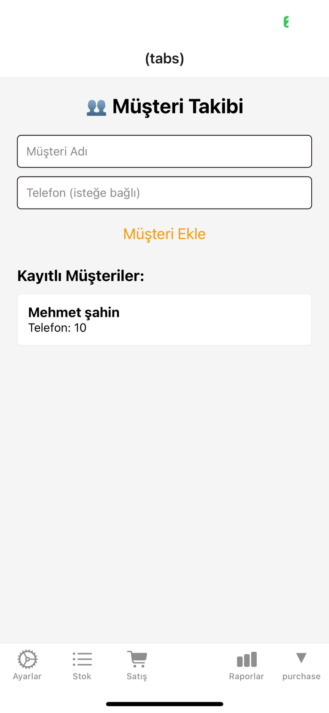
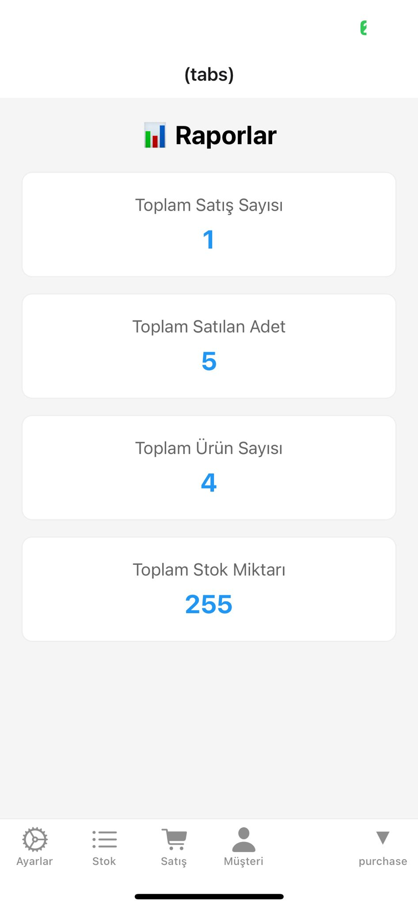
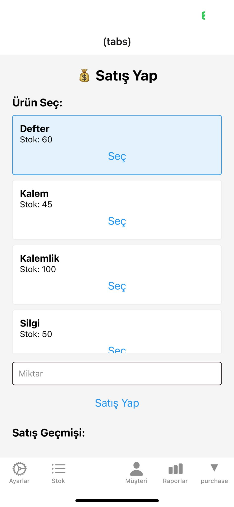
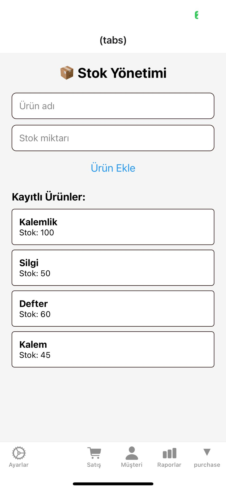

# ERP Lite – Basit Kurumsal Kaynak Planlama Mobil Uygulaması

Mini ERP Mobil Uygulaması | Kendi Geliştirdiğim Proje
Küçük işletmelerin temel operasyonlarını yönetmeleri için sıfırdan geliştirdiğim bir mobil uygulama.
Stok, Satış, Müşteri (CRM) ve Satın Alma modüllerini içeren 5 farklı ekran tasarlandı ve kodlandı.
Kullanıcıların toplam satış, stok durumu ve ürün adetleri gibi kritik verileri görebileceği bir Raporlama ekranı geliştirildi.
[Firebase/Firestore gibi] bir veritabanı kullanılarak verilerin gerçek zamanlı olarak eklenmesi, güncellenmesi ve listelenmesi sağlandı.
Kullanılan Teknolojiler:React Native, Firebase, Expo, TypeScript

## Özellikler

- ✅ Stok Yönetimi
- ✅ Satış Yönetimi
- ✅ Müşteri Takibi
- ✅ Satın Alma
- ✅ Raporlama

## Kurulum

1. `git clone https://github.com/oktaykarapolat/erp-lite.git`
2. `npm install`
3. `npx expo start`

## Teknolojiler

- React Native (Expo)
- Firebase Firestore
- Firebase Authentication
